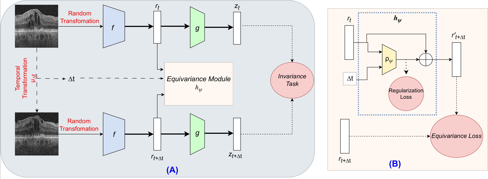

# Time-Equivariant Contrastive Learning for Degenerative Disease Progression in Retinal OCT (MICCAI'24)
 [**Paper**](https://arxiv.org/abs/2405.09404)
 
This repository is the official Pytorch implementation of MICCAI 2024 paper [Time-Equivariant Contrastive Learning for Degenerative Disease Progression in Retinal OCT](https://arxiv.org/abs/2405.09404) by Taha Emre, Arunava Chakravarty, Dmitrii Lachinov, Antoine Rivail, Ursula Schmidt-Erfurth and Hrvoje Bogunović.

TC is a non-contrastive pretraining network, that uses temporal information between OCT volumes acquired at different times. It learns invariances to image transformations in the projection space, while learning temporal equivariance in the representation space. A specially designed prediction module can manipulate the representations directly in the representation space by using the starting point and the time difference without accessing the future scans. We showed that the futures forwarded in time have more predictive power in temporal disease progression detection task.

<p align="center">
  
</p>

## Requirements
- Torch>=2.0
- Torchvision
- MONAI==1.0.1
- Numpy
- Pandas

## Dataset

 [Harbor](https://clinicaltrials.gov/ct2/show/NCT00891735) dataset is used for self-supervised pre-training and supervised evaluation. Unfortunately we cannot release the dataset.

Make sure that your folder structure is similar to ours. Such as .../pat_id/visit_day/volume.dat Visit day is in days. Such as 000, 030 ... 720.

 `class TemporalDataset` handles temporal pair generation.

## Training

### Self-supervised training
This script is specifically for TC, but we included model and loss definitions that are used in testing. The ablation studies and comparisons can be run in the similar manner, please see /src/models/vicreg for all available models.

    python src/train_TC.py --save_dir=./saved_models/experiment_1 ---epochs=300 --batch_size=128 --lr=0.0001 --lr_sch=cosine --wd=1e-6 --grad_norm_clip=1.5 --num_workers=14 --lin_iters=50 --ssl_data_dir=/ssl_data --exclude_nb --projector_hidden=2048 --backbone=resnet50 --in_ch=1 --warmup_epochs=10 --vic_lambda=15.0 --vic_mu=25.0 --vic_nu=5.0 --min_diff=30 --max_diff=360 --tc_eq=0.1 --tc_t=0.01 --tc_c=1.0 --predictor_hidden=128 --pred_bias_last --exclude_nb

### Linear Evaluation
After pretraining, you can run linear evaluation.

    python src/linear_eval.py --data_dir=/supervsed_datad --pretrained --pretrained_model=temporal/TC/experiment_1/epoch_300.tar --epochs=50 --batch_size=128 --warmup_epochs=0 --lr=1e-4 --backbone=resnet50

### Linear Evaluation with Future Forwarding
One of the novel aspect of TC is the ability to manipulate the time equivariant representation space. The code propogates the extracted futures by 6 months, and then combine them with the starting points to make the perdiction.

    python src/linear_eval.py --data_dir=/supervsed_data --pretrained --pretrained_model=temporal/TC/experiment_1/epoch_300.tar --epochs=50 --batch_size=128 --warmup_epochs=0 --lr=1e-4 --backbone=resnet50
    
## Citation

Please consider citing TC paper if it is useful for you:

```
@inproceedings{emre2024tc,
    title={Time-Equivariant Contrastive Learning for Degenerative Disease Progression in Retinal OCT},
    author={Emre, Taha and Chakravarty, Arunava and Lachinov, Dmitrii and Rivail, Antoine and Schmidt-Erfurth, Ursula and Bogunović, Hrvoje},
    booktitle={International Conference on Medical Image Computing and Computer-Assisted Intervention},
    year={2024},
    organization={Springer}
}
```
